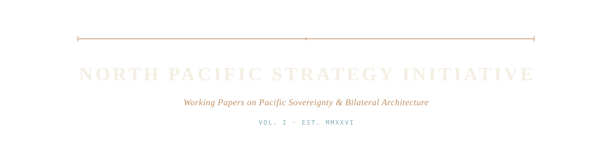

<p align="center">
  
</p>

<p align="center">
  <em>Working Papers on Pacific Sovereignty &amp; Bilateral Architecture</em>
</p>

<p align="center">
  <code>VOL.&nbsp;I</code> &nbsp;·&nbsp; <code>EST.&nbsp;MMXXVI</code>
</p>

<p align="center">
  <a href="https://npsi.ca">npsi.ca</a> &nbsp;·&nbsp;
  <a href="https://www.linkedin.com/company/north-pacific-strategy-initiative/">LinkedIn</a> &nbsp;·&nbsp;
  <a href="mailto:jesse@fitforgov.com">jesse@fitforgov.com</a>
</p>

---

An independent research imprint publishing reference-grade working papers on Pacific sovereignty, bilateral financial architecture, and the defensive options available to middle powers in a period of dollar-system stress.

This repository is the source of the website at [`npsi.ca`](https://npsi.ca). Plain static HTML and CSS, hand-authored, no JavaScript framework, no build step. The publication exists to be read, cited, and quietly forwarded — not to be optimised for engagement.

## Working papers

| № | Title | Status | Released |
|---|---|---|---|
| **No. 1** | [A Canada–Korea Pacific Infrastructure Facility](https://npsi.ca/wp1/) | `v1.0` &nbsp;·&nbsp; For Discussion | April 2026 |
| **No. 2** | [A Canada–United States Energy and Compute Compact](https://npsi.ca/wp2/) | `v0.9` &nbsp;·&nbsp; Complete Draft | May 2026 |

> *forthcoming · `NPSI-BN-002` Confederation Mathematics · `NPSI-WP-003` Pacific Defence-Industrial Corridor*

## What this site is — and is not

The constraints below are non-negotiable. They are the brand discipline. Drift on any of them costs the imprint its credibility.

| | |
|---|---|
| Not an advocacy site. | No campaign-style copy. No pressure CTAs. |
| Not a personal platform. | The editor signs the work; the imprint hosts it. |
| Not a content stream. | Working papers publish when substantive material is ready. |
| Not a consulting page. | No services menu, no rates, no "work with us." |
| Not a tracking surface. | Cookieless analytics via Umami only; no third-party scripts beyond fonts. |
| Not a movement. | No flags, no national symbols, no slogans. Treaty-document register only. |
| Not a JavaScript framework SPA. | Plain HTML and CSS. No build step. No React, no Vue, no Next.js. |

Full discipline in [`CLAUDE.md`](./CLAUDE.md).

## Visual identity

| Token | Hex | Role |
|---|---|---|
| `--navy`   | `#0E2B47` | **Pacific Navy** &nbsp;·&nbsp; primary ink |
| `--bronze` | `#A47148` | **Treaty Bronze** &nbsp;·&nbsp; accent only; never used as fill; ≤5% of any composition |
| `--teal`   | `#3D6A78` | **Maritime Teal** &nbsp;·&nbsp; section markers, monospace metadata |
| `--cream`  | `#F4EFE3` | **Document Cream** &nbsp;·&nbsp; page background; never pure white |

Three typefaces: **Source Serif 4** (display + body), **JetBrains Mono** (metadata + KPI numbers), **Noto Serif KR / Noto Sans KR** (Korean script).

Hard rules: no red, no flags, no national symbols, no Inter or Helvetica, no exclamation marks, no first person in working-paper body text, no anti-American framing.

## Repository structure

```text
npsi-site/
├── CLAUDE.md                  brand discipline + institutional memory
├── DEPLOYMENT.md              Cloudflare Pages / Netlify / Vercel
├── README.md                  this file
├── index.html                 home — current working paper, archive, the imprint
├── 404.html
├── about/index.html           the imprint, methodology, editorial standards
├── engage/index.html          how to contribute named commentary
├── commentary/index.html      named-commentary index per paper
├── colophon/index.html        typography, design, technical credits
├── wp1/index.html             Working Paper No. 1 — CKPIF
├── wp2/index.html             Working Paper No. 2 — Energy & Compute Compact
└── assets/
    ├── css/site.css           tokenized stylesheet, no build
    └── img/                   wordmark, favicons, OG cards, paper figures
```

## Contributing

Substantive editorial commentary, factual corrections, and technical critique are welcomed. Four channels are described on the [Engage](https://npsi.ca/engage/) page.

| | How |
|---|---|
| **Named commentary** | 500–1,500 attributed words to [jesse@fitforgov.com](mailto:jesse@fitforgov.com) |
| **Pull requests** | Specific edit proposals against the relevant paper repo |
| **Issues** | Factual questions, technical critique, general comment |
| **Citation** | Working papers are CC-BY-4.0; cite, share, build upon |

Selection is based on editorial merit — not on agreement with the thesis. Sharp, well-sourced disagreement is the most editorially valuable form of contribution.

## Licensing

| | License |
|---|---|
| Working paper text | [CC-BY-4.0](https://creativecommons.org/licenses/by/4.0/) — share, adapt, build upon, including commercially, with attribution |
| Site source code | MIT |
| Figures | CC-BY-4.0 unless otherwise noted on the figure |
| NPSI wordmark and visual identity | Not licensed. The mark is editorially independent and is not for re-use. |

## Local preview

```sh
python3 -m http.server 8000
# open http://localhost:8000
```

Production deployment is documented in [`DEPLOYMENT.md`](./DEPLOYMENT.md). The site deploys to Cloudflare Pages as plain static files; no build step.

## Editor

**Jesse James** &nbsp;·&nbsp; Victoria, British Columbia &nbsp;·&nbsp; [jesse@fitforgov.com](mailto:jesse@fitforgov.com)

The editor signs the work; the imprint hosts it.

---

<sub>NORTH PACIFIC STRATEGY INITIATIVE &nbsp;·&nbsp; VOL.&nbsp;I &nbsp;·&nbsp; EST.&nbsp;MMXXVI &nbsp;·&nbsp; <a href="https://npsi.ca">npsi.ca</a></sub>
