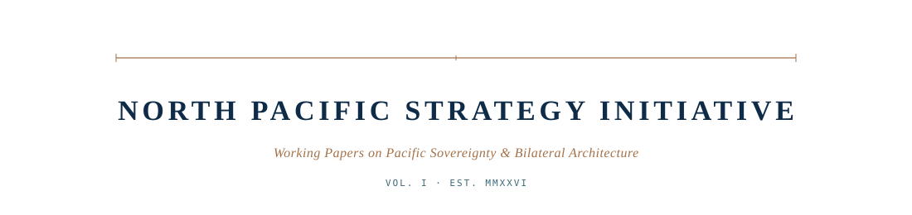

<p align="center">
  <picture>
    <source media="(prefers-color-scheme: dark)" srcset="./assets/img/npsi-wordmark.svg">
    
  </picture>
</p>

<p align="center">
  <em>Working Papers on Pacific Sovereignty &amp; Bilateral Architecture</em>
</p>

<p align="center">
  <code>VOL.&nbsp;I</code> &nbsp;·&nbsp; <code>EST.&nbsp;MMXXVI</code>
</p>

<p align="center">
  <a href="https://npsi.ca">npsi.ca</a> &nbsp;·&nbsp;
  <a href="https://www.linkedin.com/company/north-pacific-strategy-initiative/">LinkedIn</a> &nbsp;·&nbsp;
  <a href="mailto:editor@npsi.ca">editor@npsi.ca</a>
</p>

---

An independent research imprint publishing working papers on Pacific sovereignty, bilateral financial architecture, and the defensive options available to middle powers in a period of dollar-system stress. Written and funded by one person; the editor's outside interests are declared at [npsi.ca/disclosure](https://npsi.ca/disclosure/).

This repository is the source of [`npsi.ca`](https://npsi.ca): plain static HTML and CSS, hand-authored, no JavaScript framework, no build step. Its commit history is the public record of every change to every document.

## The publications

**Current working paper:** No. 11, [*Rated AAA by the Issuer*](https://npsi.ca/wp11/) (v1.0, 28 July 2026).

| Line | ID | Where |
|---|---|---|
| Working Papers | `NPSI-WP-NNN` | [npsi.ca/#archive](https://npsi.ca/#archive) — Nos. 1–5, 7, 9–11 (6 and 8 unreleased) |
| Technical Briefings | `NPSI-TB-NNN` | [npsi.ca/#briefings](https://npsi.ca/#briefings) |
| Briefing Notes | `NPSI-BN-NNN` | [npsi.ca/#briefings](https://npsi.ca/#briefings) |
| Special Briefings | `NPSI-SB-NNN` | [npsi.ca/#briefings](https://npsi.ca/#briefings) |
| The Pacific Ledger | `NPSI-PL-NNN` | [npsi.ca/ledger](https://npsi.ca/ledger/) |

The full index, with a one-line abstract per document, is maintained at [npsi.ca/llms.txt](https://npsi.ca/llms.txt); complete abstracts and citation metadata are at [npsi.ca/llms-full.txt](https://npsi.ca/llms-full.txt). Every reading view carries Highwire `citation_*` tags and Schema.org JSON-LD.

## What this site is — and is not

| | |
|---|---|
| Not an advocacy site. | No campaign-style copy. No pressure CTAs. |
| Not a personal platform. | The editor signs the work; the imprint hosts it. |
| Not a content stream. | Working papers publish when substantive material is ready. |
| Not a consulting page. | No services menu, no rates, no "work with us." |
| Not a tracking surface. | Cookieless analytics via Umami, the only third-party script; typefaces from Google Fonts. |
| Not a movement. | No flags, no national symbols, no slogans. Treaty-document register only. |
| Not a JavaScript framework SPA. | Plain HTML and CSS. No build step. |

## Visual identity

Dark-first since July 2026: the same four-colour brand, inverted — Document Cream is the ink, Pacific Navy is the paper. Readers whose device prefers light, and every printed page, get the light palette.

| Token | Screen (dark) | Print (light) | Role |
|---|---|---|---|
| `--navy`   | `#F4EFE3` | `#0E2B47` | **Primary ink** — wordmark, headings, dominant typography |
| `--bronze` | `#C08D60` | `#A47148` | **Treaty Bronze** &nbsp;·&nbsp; accent only; never used as fill; ≤5% of any composition |
| `--teal`   | `#7FA8B5` | `#3D6A78` | **Maritime Teal** &nbsp;·&nbsp; section markers, monospace metadata |
| `--cream`  | `#081C30` | `#FFFFFF` | **Page background** — deep Pacific Navy on screen |

Typefaces: **Source Serif 4** (display and body), **Source Sans 3** (UI labels), **JetBrains Mono** (metadata and figures); **Noto Serif KR / Noto Sans KR** for Korean script.

House rules: no red, no flags, no national symbols, no exclamation marks, no first person in working-paper body text. Framing discipline: counterparty-risk diversification — additive, not antagonistic.

## Repository structure

```text
npsi-site/
├── index.html                 home — current paper, the Ledger, archive, briefings
├── 404.html
├── about/  disclosure/  engage/  commentary/  colophon/  ledger/
├── wp1/ … wp11/               working papers (no wp6, wp8): index.html + working-paper.pdf
├── tb1/  bn1/  sb1/  sb2/  sb3/   briefing lines: index.html + PDF
├── pl1/                       The Pacific Ledger №01: index.html + PDF
├── assets/
│   ├── css/site.css           tokenized stylesheet, no build
│   └── img/                   wordmark, favicons, share cards (SVG source + PNG), figures
├── llms.txt  llms-full.txt    machine-readable indexes
├── sitemap.xml  robots.txt  vercel.json  .well-known/security.txt
└── tools/                     publishing checks and card rendering (not deployed)
```

## Contributing

Substantive commentary, factual corrections, and technical critique are welcomed. The channels are described on the [Engage](https://npsi.ca/engage/) page.

| | How |
|---|---|
| **Named commentary** | 500–1,500 attributed words to [editor@npsi.ca](mailto:editor@npsi.ca) |
| **Pull requests** | Specific edit proposals against this repository, one folder per document |
| **Issues** | Factual questions, technical critique, general comment |
| **Citation** | Working papers are CC-BY-4.0; cite, share, build upon |

Selection is based on editorial merit — not on agreement with the thesis.

## Licensing

| | Licence |
|---|---|
| Working paper text | [CC-BY-4.0](https://creativecommons.org/licenses/by/4.0/) — share, adapt, build upon, including commercially, with attribution |
| Site source code | MIT |
| Figures | CC-BY-4.0 unless otherwise noted on the figure |
| NPSI wordmark and visual identity | Not licensed; not for re-use. |

## Local preview and checks

```sh
python3 -m http.server 8000      # open http://localhost:8000
python3 tools/sitecheck.py       # links, chrome, metadata, sitemap — run before every commit
```

The site deploys to Vercel as plain static files (headers and redirects in `vercel.json`); no build step. Deployment notes are in [`DEPLOYMENT.md`](./DEPLOYMENT.md).

## Editor

**Jesse James** &nbsp;·&nbsp; Victoria, British Columbia &nbsp;·&nbsp; [editor@npsi.ca](mailto:editor@npsi.ca)

The editor signs the work; the imprint hosts it.

---

<sub>NORTH PACIFIC STRATEGY INITIATIVE &nbsp;·&nbsp; VOL.&nbsp;I &nbsp;·&nbsp; EST.&nbsp;MMXXVI &nbsp;·&nbsp; <a href="https://npsi.ca">npsi.ca</a></sub>
